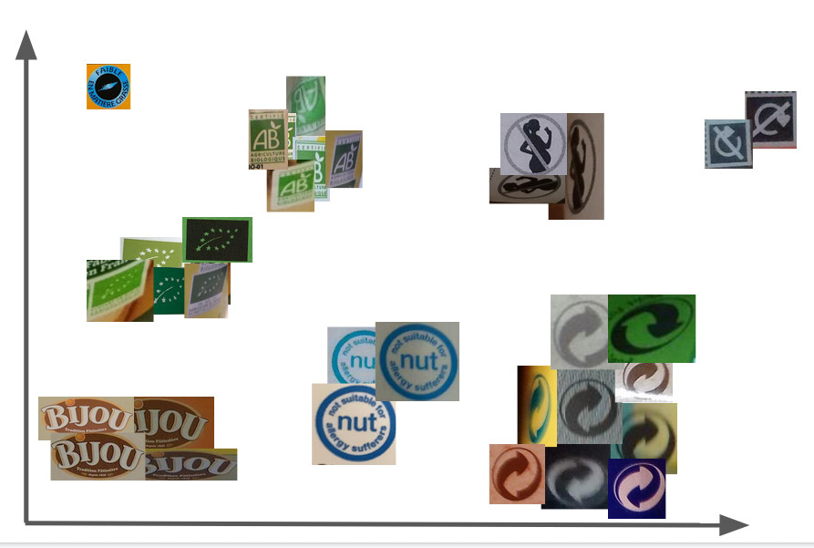

# Robotoff ANN

This project helps [robotoff](https://github.com/openfoodfacts/robotoff) in categorizing logos.

## Tangible results
* You can see all the crops generated and up for manual annotation in [Hunger Games](https://hunger.openfoodfacts.org/logos), our gamified annotation engine.
* Robotoff pings new crops and annotations in the #xxx Slack channel

## Contributing

To setup the project you must have a recent version of docker and docker-compose installed.

use `make dev`.

`make quality` will run linters and tests.

Models used in production are published in releases of [openfoodfacts-ai](https://github.com/openfoodfacts/openfoodfacts-ai/).

See more in Makefile.

## Architecture

From images we extract logos (logo detection is in robotoff).
Those logos are embedded in a metric space using a specific model[^embedding].

We then use [approximate nearest neighbors](https://en.wikipedia.org/wiki/Nearest_neighbor_search#Approximate_nearest_neighbor) [^ann_index]
in this metric space
to try to classify the logos from known examples [KNN](https://en.wikipedia.org/wiki/K-nearest_neighbors_algorithm).

Those logos will then
help apply labels to [Open Food Facts](https://world.openfoodfacts.org) products.

Main entry point is [API](./api.py) to get nearest neighbors,
either for logo id [^nn_id], or an embedding vector [^nn_embedding], or add new logo from a image [^add_logo].

Note that the approximate nearest neighbors index is only regenerated using a specific command [^index_regenerate].

[^embedding]: see `embeddings.generate_embeddings`
and `settings.DEFAULT_MODEL`

[^ann_index]: see `api.ANNIndex` which currently relies on [Annoy](https://github.com/spotify/annoy/)

[^nn_id]: see `api.ANNResource` and `api.ANNBatchResource`

[^nn_embedding]: see `api.ANNEmbeddingResource`

[^add_logo]: see `api.AddLogoResource`

[^index_regenerate]: see `manage.generate_index`
